# Administración de asistencia

## ¿Quiénes pueden administrar asistencia?
Para poder llevar a cabo la administración de asistentes a un evento de EventoL es necesario que la persona que lo realiza este logeada a la página como organizador o tener permisos para administrar asistencia.

## ¿Cómo dar permisos para administrar asistencia?
**Este permiso solo lo puede dar un organizador**.

Para dar el permisos se tiene que ir a la pagina de inicio del evento, seleccionar la opción "Colaboradores" en la barra superior (la cual desplegara una lista) y seleccionar la opción "Administrar miembros de registración". 

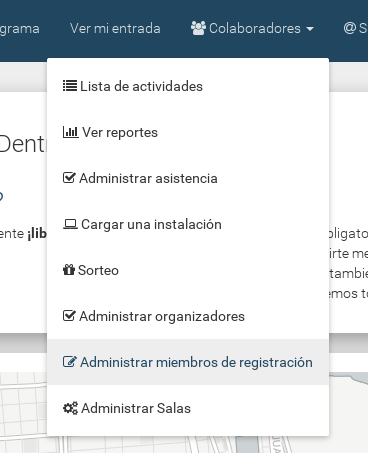

Dentro de esa opción vamos a encontrar un pantalla donde podemos buscar colaboradores para que puedan registrar asistencia.

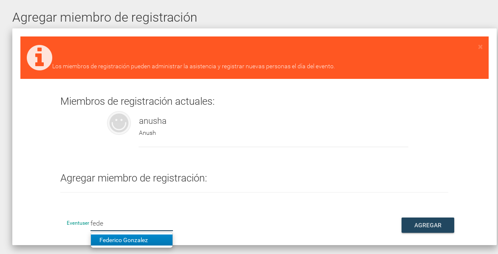

Una vez seleccionado el colaborar, presionamos en "Agregar" para confirmar el permiso.
Una vez confirmado podemos ver el mensaje de confirmación en la barra naranja.

Ya confirmados los colaborados podemos ver la lista completa en la pantalla de "Administrar miembros de registración".

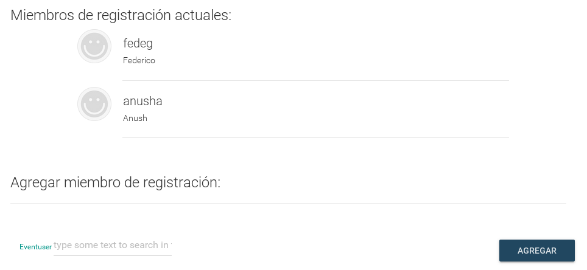

## ¿Cómo confirmar asistencia?

Primero deberá seleccionar la opción "Colaboradores" de la barra superior, la cual desplegará una lista.
En esta lista haga click en la opción "Administrar asistencia".

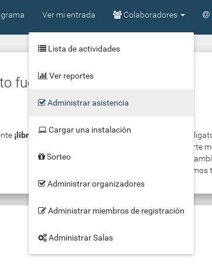

### Asistentes con entrada impresa (mediante código qr)
Para el caso del qr vamos a seleccionar la opción "ESCANEAR QR"

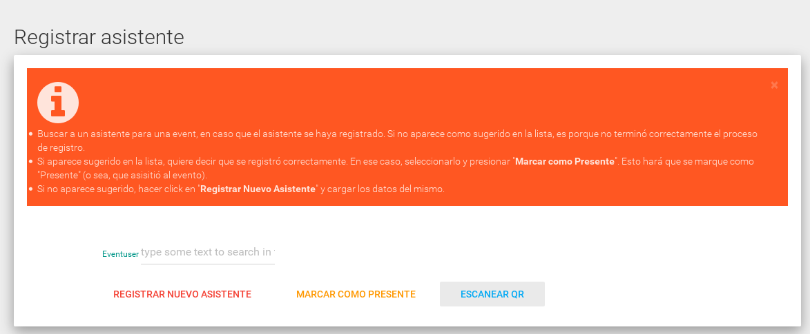

Una vez seleccionada esa opción (quizás el navegador nos pide permiso para la camara), vamos a ver la camara en la pantalla y solamente tenemos que poner el código qr de la entrada a la vista de la camara.

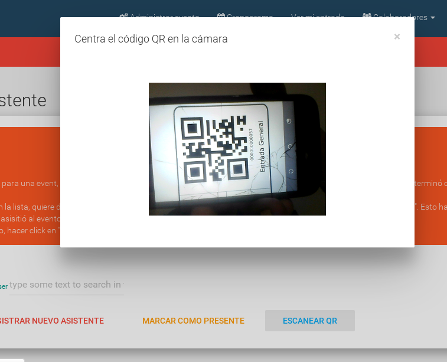

Automáticamente se detecta el código y se confirma la asistencia, mostrando también la confirmación en la pantalla.

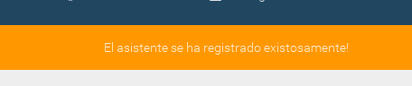

### Asistentes registrados previamente (también para colaboradores, instaladores, organizadores, ...)
Directamente en la pantalla de "Administrar asistencia" vamos a ingresar el nombre del usuario y se nos va a autocompletar según los asistentes del evento.
Cuando aparezca el asistente que queremos confirmar vamos a seleccionarlo haciéndole click directo en el nombre.

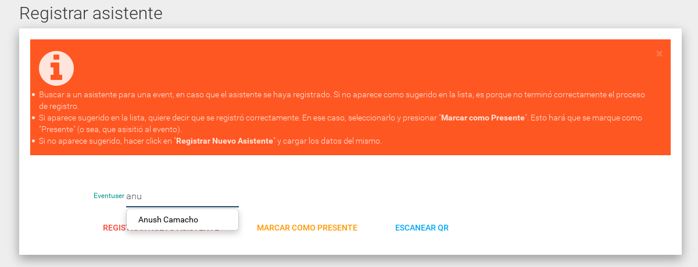

Una vez seleccionardo el asistente vamos a hacer click en "MARCAR COMO PRESENTE"

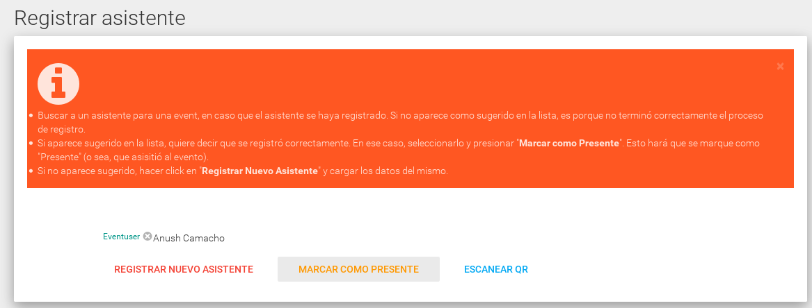

Ya con eso se confirma la asistencia, mostrando también la confirmación en la pantalla.

### Asistentes no registrados (asistentes espontáneos o personas no registradas en el evento)
Directamente en la pantalla de "Administrar asistencia" vamos a seleccionar la opción "REGISTRAR NUEVO ASISTENTE".

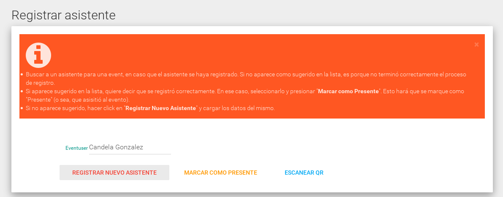

Una vez seleccionada la opción vamos a ver un formulario para completar.

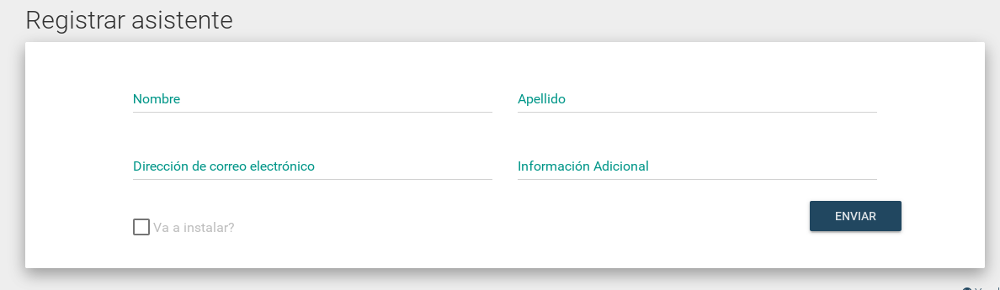

Completamos el formulario con los datos del asistente.

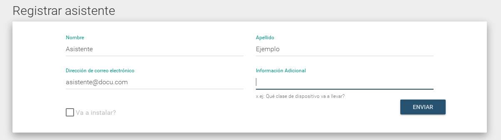

Tambien vamos a indicar si viene a instalar alguna maquina.

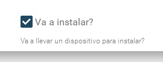

Una vez completos los datos, hacemos click en el botón "ENVIAR" y ya con eso se confirma la asistencia, mostrando también la confirmación en la pantalla.

## Imprimir lista de asistentes
**Esta opción es solo recomendada en casos donde no se tiene internet o tiene problemas para usar la plataforma dentro del evento**
**Para imprimir la lista de asistentes hay que ser organizador del evento.**

Ingresamos al [admin](https://flisol.usla.org.ar/admin/)

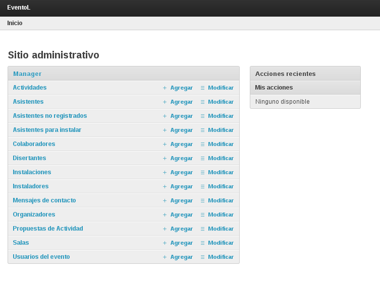

Entramos en la opción "Asistentes"

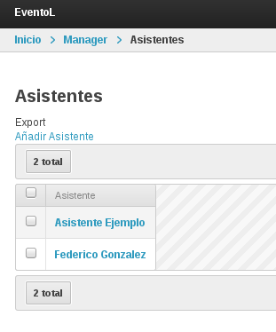

En la parte inferior del titulo de "Asistentes" podemos encontrar el botón para exportar la información.

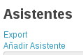

Una vez seleccionado "export" vamos a poder seleccionar el formato en el que deseamos exportar la información.

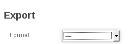

Por ejemplo exportando en csv:

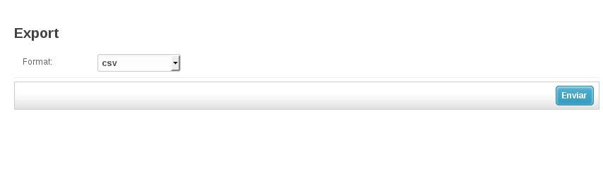
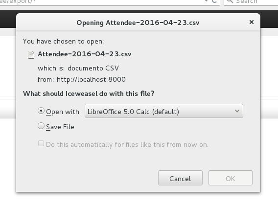

Por ejemplo exportando en xls:

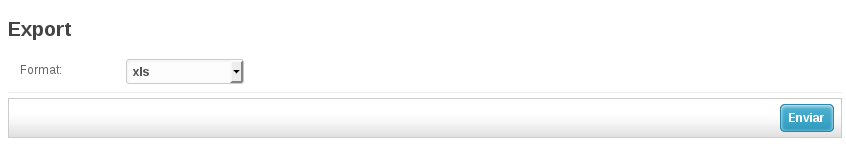
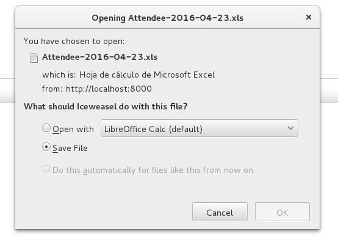