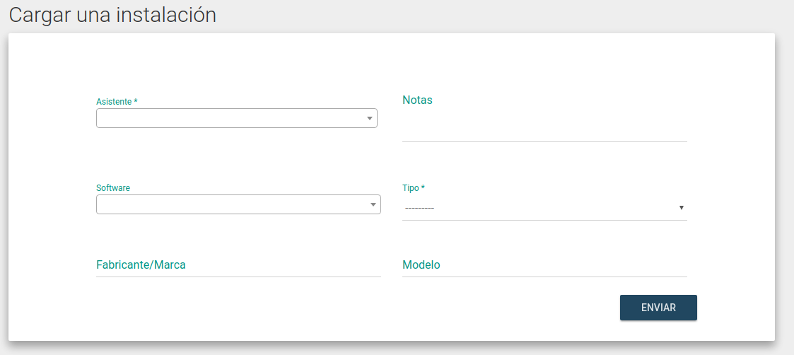

# Registrar una Instalación

* Para cargar una instalación, se debe haber registrado e iniciado sesión como **Instalador**
   (Ver [Registro de Instaladores](registro-de-instaladores.md))

* En el menú desplegable "Colaboradores", ir a la opción "Cargar una instalación":

* Cargar el formulario con los datos de la instalación, donde serán obligatorios los ítems marcados con (*):

   * `Asistente`: El asistente al evento a quien se le instaló. Se puede buscar por nombre, apellido, nick o email.
   * `Software`: El software que se le instaló. Si el mismo no figura en la lista, por favor avisanos para agregarlo.
   * `Notas`: Campo de texto libre, donde se puede documentar cualquier cosa que el instalador crea relevante.
   * `Tipo`: El tipo de dispositivo que fue instalado (PC, Notebook, Móvil, etc.).
   * `Marca`: Marca/Fabricante del dispositivo.
   * `Modelo`: Modelo del dispositivo instalado.

