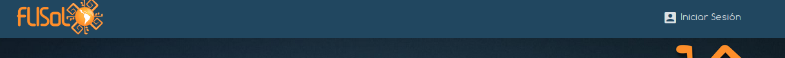
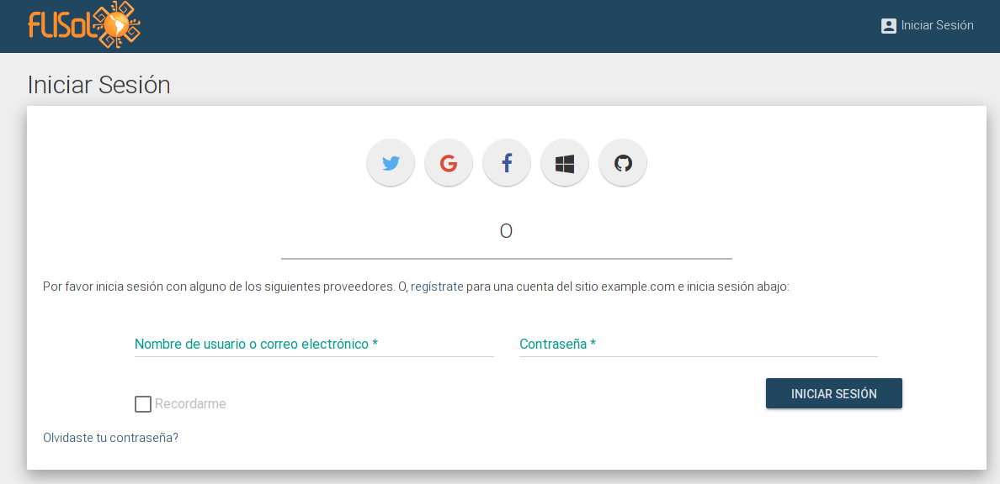
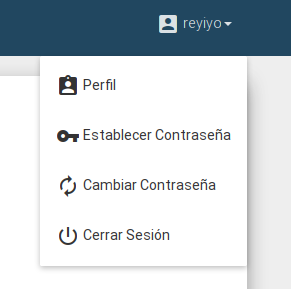

# Login

Casi para todo, es necesario estar autenticado. Para esto, primero es necesario tener un usuario de la plataforma eventoL.

## Crear usuario

Ingresar a link "Iniciar Sesión" en la esquina superior derecha de la pantalla.

Al ingresar, aparecerá una pantalla como la siguiente:

Aquí se puede elegir entre crear una cuenta con una red social (oAuth) o crear una cuenta de eventoL. Para crear una cuenta de
eventoL, hay que seguir el link que dice "regístrate" debajo de los botones de redes sociales.

Recomendamos el inicio de sesión con algún proveedor de oAuth por cuestiones de seguridad y sencillez.

Al hacer click en cualquiera de los botones de redes sociales, serás redirigido al formulario de login de tu red social
(verifica siempre la url y el certificado ssl en tu navegador). Te pedirá que le des permisos a la app eventoL y te
redigirá nuevamente a eventoL (no pedimos ni usamos ningún dato más allá de nombre, apellido y mail). De vuelta en
eventoL, te aparecerá un formulario para cargar los datos faltantes. Una vez cargados, ya tienes creado el usuario y
podrás ver los datos en tu perfil.

## Establecer una contraseña

Si vas a ser organizador de algún evento, para entrar a la página de administración, es necesario establecer una contraseña.
La misma la puedes establecer seleccionando la opción "Establecer contraseña" en el menú desplegable del usuario.

## Iniciar sesión

Una vez que tenemos el usuario creado, podemos iniciar sesión en la aplicación. Para esto, ingresar a link 
"Iniciar Sesión" en la esquina superior derecha de la pantalla.

Y seleccionar la opción con la que el usuario fue creado. Por ejemplo, si el usuario lo creamos seleccionando "Twitter",
luego iniciaremos sesión seleccionando la opción "Twitter".