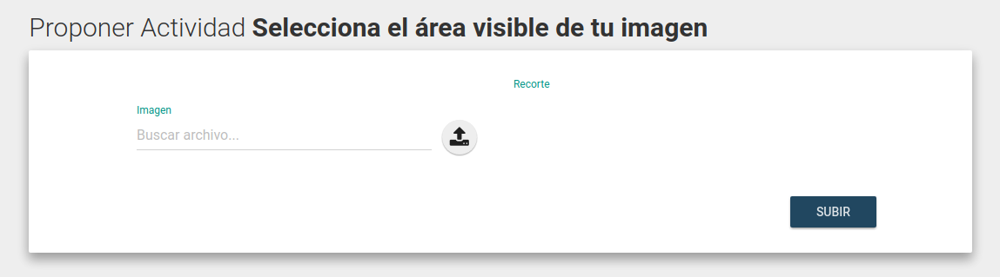
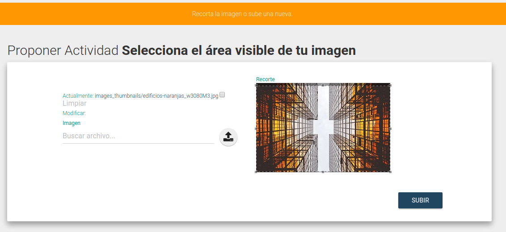

# Propuestas de Actividades

Esta funcionalidad sirve para recibir propuestas de actividades (Call for charlas) a través de la plataforma.

Cualquier persona puede enviar propuestas de actividades y no necesita registrarse. Para esto:

1. Elegir la opción "Proponé tu Actividad" en la barra superior de la página principal del evento.

2. Completar el formulario teniendo en cuenta los datos requeridos:
   * `Título`: Título de la actividad
   * `Nombres de los disertantes`: Los nombres de los disertantes, separados por coma.
   * `Resumen`: Dos o tres oraciones que describan la actividad.
   * `Descripción completa`: Todo lo que puedas escribir acerca de la actividad.
   * `Contacto de los disertantes`: Un mail para que la organización pueda contactar a quien está realizando la propuesta.
   * `Etiquetas/Tags`: Una lista separada por coma con las palabras claves de la actividad.
   * `Nivel`: A qué tipo de público está dirigida la actividad o cuál es el conocimiento técnico deseable para asistir a la misma.
   * `Presentación`: Si al momento de realizar la propuesta ya tiene lista la presentación (diapositivas), puede subirla y estará disponible para descargar.
   * `Información Adicional`: Cualquier cosa que quien hace la propuesta considere relevante para la organización. Por ejemplo, si necesita un proyector, 
   más tiempo del estipulado, audio, etc.

3. Luego de completar los datos anteriores, el siguiente formulario propone subir una imagen.

Esta imagen sirve para promocionar la actividad en el carrusel de la página principal de la sede. Es opcional, pero si
no se sube una imagen, la actividad no aparecerá en la página principal.

Hacer click sobre el campo que dice "Buscar Imagen..." y elegir un archivo para subir. Una vez elegido, hacer click en
el botón "Subir!".

4. Esperar un momento hasta que suba la imagen. Luego el formulario nos propondrá recortar la imagen para que tenga un
tamaño adecuado para los lugares donde se muestra:

Elegir el área visible a gusto y hacer click en "Subir!". Luego nos redigirá a la página de detalle de la propuesta.